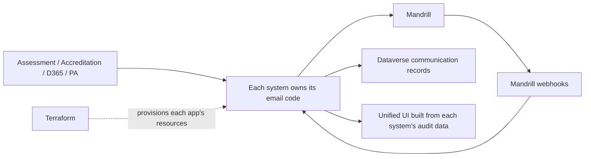
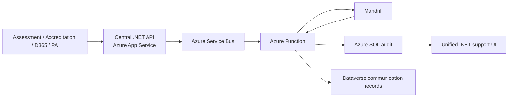
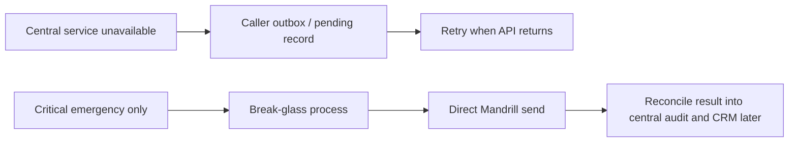
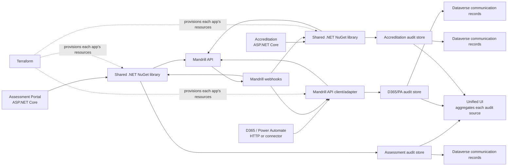
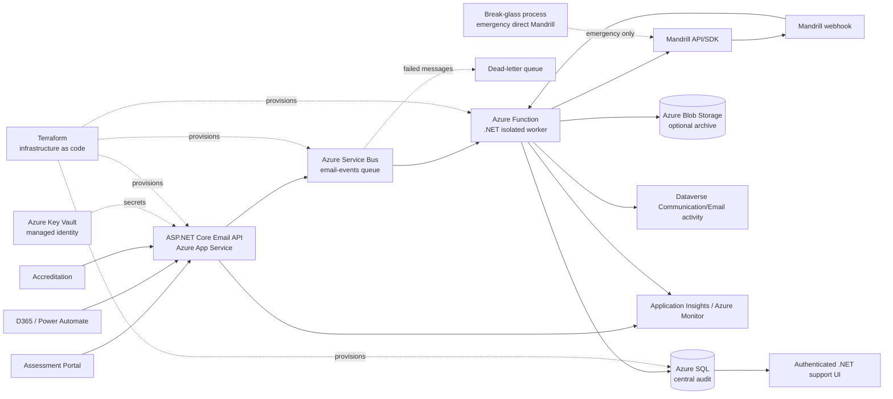
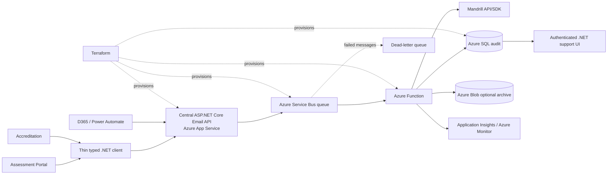

# Transactional Email Architecture: 10-Minute Presentation

## Opening: the decision in one sentence

“We need to choose whether each application owns email sending, or whether one small service owns the common provider, reliability and audit responsibilities.”

## Simple diagrams for the presentation

### Option 1: distributed ownership

### Option 2: central ownership

### Option 3: controlled fallback

Use these three diagrams first. Use the detailed diagrams below only when discussing implementation questions.

## Option 1: Shared Library / Distributed Sending

**Technology:** reusable .NET class library/NuGet package, Mandrill API/SDK, each application’s own configuration and secrets, webhook receiver, application audit database/logging, Dataverse write-back, unified UI and Terraform per application. No central API, Service Bus or Function is required, but every consumer must implement or host equivalent responsibilities.

**Say:** “This diagram is simple at the centre because there is no centre, but the responsibilities have not disappeared. Each system needs its own webhook handling, audit storage, CRM write-back, UI contribution, retries, secrets and Terraform. If Assessment is unavailable, Accreditation and D365 can still send, but the platform is duplicated.”

## Option 2: Central Email Service

**Technology:** ASP.NET Core Minimal API on Azure App Service, optional Azure API Management in front, Azure Service Bus queue, .NET isolated Azure Function, Mandrill API/SDK, separate Azure SQL audit database, Application Insights/Azure Monitor, Key Vault and managed identity, Dataverse write-back.

**Say:** “All systems call one stable email API. The API hides Mandrill, validates the request and places work on Service Bus. A Function sends the email and records the result in SQL. Mandrill webhooks update delivery status. Users see a CRM communication summary, while support sees the full audit UI.”

## Option 3: Hybrid Convenience Client

**Technology:** Option 2 technology plus a thin .NET client/NuGet package that contains no Mandrill code and only calls the central API.

**Say:** “This is not a separate runtime architecture. It is the central service with a developer-friendly wrapper for .NET applications. It can be added later if typed client calls are useful. It is not required for the initial decision.”

## Simple comparison

| Question | Option 1: Shared library | Option 2: Central service | Option 3: Hybrid |
|---|---|---|---|
| Who calls Mandrill? | Every consumer | One central service | One central service |
| Where is logging? | Distributed | One SQL audit + support UI | One SQL audit + support UI |
| Failure isolation | Strong between systems | Shared dependency, protected by HA/queue/retry | Same as central service |
| Maintenance | Repeated in every consumer | One platform to maintain | Central platform plus thin client |
| D365/PA support | Separate HTTP integration needed | Direct API integration | Direct API integration |
| Template/provider changes | Deploy/update many consumers | Change once centrally | Change once centrally |
| Extra infrastructure | Minimal | App Service, Service Bus, Function, SQL, monitoring | Same as central service |
| Best fit | Truly independent systems with different providers | One provider, many consumers and shared support needs | Central service plus .NET developer convenience |

## Choose 1 if / Choose 2 if

| Choose Option 1 if... | Choose Option 2 if... |
|---|---|
| Systems must keep sending even if a central platform is unavailable. | Multiple systems use the same Mandrill account/provider. |
| Teams accept duplicated credentials, retries, mappings and audit. | The organisation wants one audit trail and support view. |
| Applications have genuinely different providers or release ownership. | Provider changes, security fixes and retry fixes should be made once. |
| The email capability is small and unlikely to grow. | D365, Power Automate, Assessment and Accreditation need the same capability. |
| Each system can absorb its own delivery/support tooling. | Operational consistency is more valuable than independent provider connections. |

## Key concerns and short answers

**“The central service is another thing to maintain.”** Correct. It is one additional platform. Terraform makes infrastructure repeatable, but code, monitoring, secrets and support still need ownership. The shared library does not remove maintenance; it distributes it across every consumer and increases version drift.

**“If the central service fails, are emails lost?”** Accepted requests are protected by Service Bus. Requests made while the API is unavailable are safe only when callers use a durable outbox/pending record and retry. D365/PA must use retry and failure paths; callers must not discard failed requests.

**“What if one system breaks?”** Authenticate and throttle callers independently. A bad Assessment request should not consume all capacity. Queue retries and dead-letter messages isolate provider failures. App Service health checks, rollback, monitoring and an optional break-glass sender reduce central blast radius.

**“Do users need a template admin screen?”** No initially. Existing Mandrill template content can be edited live without service deployment. A new template needs a key-to-slug configuration change and normal API deployment, with no planned outage. A SQL registry/admin screen is optional later for zero-deployment onboarding, approvals or versioning.

**“Do templates need downloading?”** No for sending. The service sends the Mandrill slug and variables; Mandrill renders the template. Export/download is only for backup, migration, versioning or local testing.

**“Does central email require a template repository?”** Not necessarily. A template repository means storing the full HTML/content files in source control; a mapping registry only records a stable key, Mandrill slug and required variables. Both architectures need that metadata somewhere, but neither requires a Git repository of full templates. With central service, Mandrill can remain the business-owned content editor and the central service can use a small configuration file, naming convention or later SQL registry. With shared library, the mapping is normally repeated in each application’s configuration. If the organisation requires template versioning and promotion through environments, exporting content to a repository may be useful for both approaches, not evidence against centralisation.

**“Is the mapping maintenance unique to central email?”** No. Central service concentrates it once; shared library distributes it across Assessment, Accreditation, D365/PA and other consumers. A new template can be used without a deployment only if the service dynamically accepts the Mandrill slug or reads mappings from a runtime registry. The controlled approach uses a stable key and a small configuration deployment, with no service outage. The choice is centralised governance versus distributed ownership, not mapping versus no mapping.

**“Can complex 2D/3D/4D data work?”** Yes, if the API contract accepts nested objects and lists. Simple values can be flattened by the provider adapter. Repeating lists need an explicit rendering rule or pre-rendered HTML; flattening alone does not create loops.

**“Should complex business logic live in the central service?”** No. The source system keeps domain decisions and prepares an email view model or a pre-rendered repeating section. The central service handles template lookup, generic rendering/provider formatting, delivery, retries, webhooks and audit. This prevents the central service becoming coupled to Assessment or Accreditation rules while still centralising common email operations.

**“Does a shared library avoid a template repository?”** It may avoid one central repository by letting each application own templates or mappings, but that creates multiple sources of truth. A central service can keep Mandrill as the content source and centralise only the contract/mapping metadata; it does not need to download or duplicate every template.

**“Where do normal users see the email?”** Write a small asynchronous Dataverse Communication/Email activity against the Contact or relevant CRM record. Keep detailed technical delivery history in the authenticated SQL-backed support UI. SQL is the technical audit record; CRM is the business-facing summary.

## Recommended conclusion

“Option 1 gives the strongest runtime independence, but spreads provider and support responsibility everywhere. Option 2 centralises a common capability and gives one consistent audit and operational model. For multiple consumers using one Mandrill account at 7,000–8,000 emails per month, I recommend Option 2, starting without APIM or a template admin screen. Add those only when actual governance or administration needs justify them. Option 3 is only a later convenience wrapper.”

## 10-minute running order

1. **Minute 0–1:** State the problem and decision sentence.
2. **Minutes 1–3:** Show Option 1 diagram and explain independence versus duplicated maintenance.
3. **Minutes 3–6:** Show Option 2 diagram and explain API, queue, Function, Mandrill, SQL, webhook and CRM/UI visibility.
4. **Minutes 6–7:** Show Option 3 diagram and explain that it is only a thin client, not a required third architecture.
5. **Minutes 7–8:** Show the comparison table and “choose if” guidance.
6. **Minutes 8–9:** Answer resilience, template, complex-data and CRM concerns.
7. **Minute 9–10:** Give the Option 2 recommendation and agree next step: two-template pilot with durable retry and audit verification.

## Azure learning demo

The personal lab uses the same central-service components in `rg-email-architecture-lab`: App Service API, Service Bus namespace/queue `email-events`, Azure Function, SQL database `EmailAudit`, Storage and monitoring. It is not connected to APC. Use `docs/BUILD-TUTORIAL.md` for Azure mode, local simulation mode, switching commands and cleanup.
