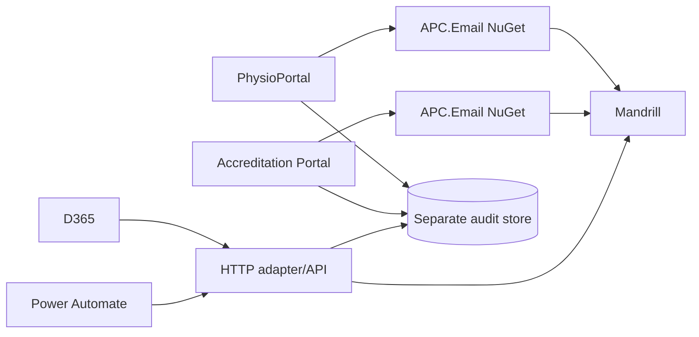
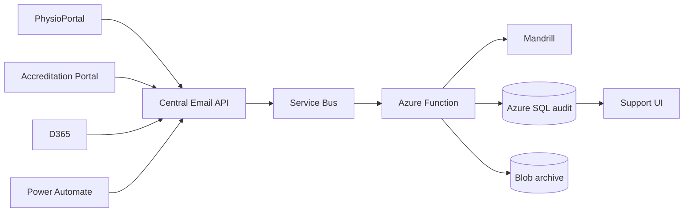

# Transactional Email Architecture Demo

## Decision context

The original Mailchimp Marketing API retrieval option was not reliable for builder HTML. Mandrill is now the selected provider. The remaining decision is how APC-owned applications should use Mandrill:

- **Shared library:** each .NET application sends directly through a common package.
- **Central email service:** all callers use one HTTP API; the service sends through Mandrill.
- **Hybrid recommendation:** .NET applications may use a thin NuGet client, but the client calls the central HTTP API. D365 and Power Automate use the same HTTP API directly.

## Architecture comparison

The shared-library approach is valid, but D365 and Power Automate still need an HTTP API. It therefore normally results in a library plus a separate API, with duplicated provider and operational concerns.

## What the demo proves

| Evidence | Shared library | Central API | Production meaning |
|---|---:|---:|---|
| Mandrill template send | Yes | Yes | Provider integration is viable |
| Nested/multi-dimensional data | Yes | Yes | Contract can carry structured domain data |
| Independent .NET process | Yes | Yes | Applications can deploy independently |
| D365/Power Automate-shaped request | Via adapter | Yes | HTTP is required for non-.NET callers |
| Central support search | Needs shared audit store | Yes | Long-term provider-independent history |

The demo converts nested domain data into flat Mandrill merge variables such as `candidate_id`, `assessment_status` and `session_location_name`. This is the important distinction: the API can accept a rich domain request, while the provider adapter maps it to the flat variables used by a template. It does not claim that Mandrill templates can directly address arbitrary nested JSON paths.

## Data and logging

The provider is not the system of record for audit. Store an APC-owned record containing:

- Correlation ID and idempotency key
- Source system and environment
- Template key and provider template/slug
- Recipient address, sender and branding
- Request timestamp, provider response and provider message ID
- Status history: accepted, sent, delivered, bounced, rejected
- Error/reject reason and retry count
- Minimal business reference such as candidate ID, not unnecessary message content

Store message bodies only if there is a confirmed legal/support requirement. They contain personal information and should have stricter access, retention and deletion rules.

## Azure recommendation

| Component | Demo | Production |
|---|---|---|
| API | ASP.NET Core local | Azure App Service |
| Async worker | Azure Functions project included | Consumption or Flex Consumption plan |
| Queue | In-memory/demo boundary | Azure Service Bus with retry and DLQ |
| Hot audit data | In-memory demo | Separate Azure SQL database |
| Long-term archive | Local files/demo | Blob Storage with lifecycle policy |
| Support authentication | Local demo key | Microsoft Entra ID |
| Secrets | Environment variables | Managed identity + Key Vault |
| API gateway | Not needed | APIM only if governance, quotas or external consumers require it |
| Infrastructure | Terraform included, not applied | Terraform per environment |

Do not add these tables to the existing APC application database. A separate email/audit database gives the service independent ownership and avoids coupling the demonstration or future service to the APC schema.

### Template mapping and redeployment

Every approach needs a way to associate the application's stable template key with the provider template and to prepare its merge variables. The approaches differ only in where that configuration lives:

- Shared library: each consuming application owns its Mandrill configuration and mapping.
- Central service: the service owns one code/configuration mapping and callers use the stable key.
- Hybrid: the central service owns the mapping; the client library only calls the service.

The POC and initial implementation use version-controlled code/configuration. A business user editing the content or version of an existing Mandrill template does not require an API redeployment. Adding a new template or changing its mapping requires a configuration change and deployment, unless a future SQL-backed registry and admin screen is introduced. That registry and screen are optional future scope, not a prerequisite for the central service.

### Support UI and deployment slots

The demo support UI is deliberately embedded in the API, so it is not a second web application. Production can start this way on one App Service, protected by Entra ID. A separate support web app is justified only if support needs independent release/scaling or a different ownership boundary. Blue/green or deployment slots are production deployment techniques, not requirements for the POC; F1 does not provide the production-grade slot/Always On experience.

### Alerts and Freshservice

Alerting is a follow-on capability, not a prerequisite for sending. Mandrill webhook events should be persisted and published to Service Bus. An Azure Function can evaluate rules such as repeated rejects, bounce thresholds or provider outage, then notify an Azure Monitor Action Group, Teams, email, or Freshservice through its supported API/connector. Ownership and escalation thresholds must be agreed before implementing this.

## Cost position

The existing personal subscription contains a free F1 App Service plan, storage and Application Insights. These can host a basic personal demo, subject to F1 limitations. Azure SQL and Service Bus Standard are not reliably free services; do not provision them for the demonstration without checking current pricing and setting a budget alert.

For production, expected costs depend on traffic, retention and tier. App Service, SQL, Service Bus, storage, monitoring and data egress must be confirmed using the Azure Pricing Calculator. Mandrill provider fees are separate from Azure costs.

## D365 and Power Automate configuration only

No D365 or Power Automate implementation is included in this repository.

### Power Automate

1. Use the existing Dataverse trigger for the relevant assessment event.
2. Add an HTTP action.
3. POST to `/api/v1/email/send`.
4. Add `X-Source-System` and `X-Api-Key` headers, stored as protected flow configuration.
5. Map Dataverse fields into `templateKey`, `to` and `data`.
6. Store the returned correlation ID for support tracing.
7. Configure retry and failure notification according to the agreed ownership model.

### D365

1. Identify the existing workflow, cloud flow or plugin that creates the email.
2. Replace or extend that step with an HTTP call or a custom connector generated from the API OpenAPI document.
3. Decide whether D365 remains the system of record for an Email activity.
4. If yes, create/update the Dataverse Email activity asynchronously using the correlation/provider ID and bind it to the Contact.
5. Use a service principal with least-privilege Email Create/Write and Contact Read permissions.
6. Do not put Mandrill credentials in D365 or a flow when the central API is used.

## Implementation plan

### Shared library path

1. Define versioned contracts and template-key ownership.
2. Implement APC-owned Mandrill adapter and configuration.
3. Package the library and consume it separately in each .NET application.
4. Build the HTTP adapter required by D365 and Power Automate.
5. Define a common audit event contract and central ingestion/store.
6. Add provider, contract, retry, failure and compatibility tests.
7. Publish and upgrade each application independently, accepting version drift risk.

### Central service path

1. Define the HTTP contract and authentication model.
2. Implement Mandrill adapter and version-controlled template mapping.
3. Add durable audit persistence and correlation IDs.
4. Add Service Bus queueing, retry and dead-letter handling.
5. Add Function consumers for provider events, archive and D365 write-back.
6. Add Entra-authenticated support UI and filtered search.
7. Deploy with Terraform to isolated dev/test/prod environments.
8. Onboard PhysioPortal, Power Automate, D365 and Accreditation incrementally.

The database-backed template registry and administration screen are optional follow-on work, justified only if authorised non-developers need to add mappings, or if template versioning, approval and multi-provider configuration must be managed at runtime.

### Agent-assisted delivery plan

Use the agent brief in `AGENT-BUILD-BRIEF.md`. Require agents to inspect the repository first, change only assigned folders, run tests/builds, never use APC credentials, and report assumptions and unresolved integration work.
