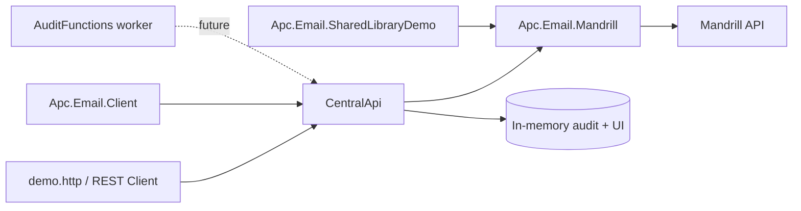

# Build Tutorial — How This Demo Was Built (in sequence)

This explains, step by step, how the `poc/email-architecture-comparison` solution was assembled, so you understand each piece and can rebuild/extend it. It is a tutorial for you (the .NET developer), not a sales document.

---

## 1. Intent

Two architectures were compared after Mandrill was chosen:

1. **Shared library / distributed sending** — each .NET app bundles a package that calls Mandrill directly.
2. **Central email service** — one HTTP API every system calls; the API sends via Mandrill.
3. **Hybrid (recommended)** — central API + optional thin .NET client so portals get a typed helper but Mandrill logic lives in one place.

The demo also needed to show: nested (2D/3D) data handling, an audit/support UI, and per-system auth.

---

## 2. Sequence of build steps

### Step 1 — Scaffold the solution and projects

```powershell
dotnet new sln --name EmailArchitectureComparison --output poc/email-architecture-comparison --format slnx
dotnet new classlib --name Apc.Email.Contracts     --output poc/email-architecture-comparison/src/Apc.Email.Contracts
dotnet new classlib --name Apc.Email.Client        --output poc/email-architecture-comparison/src/Apc.Email.Client
dotnet new classlib --name Apc.Email.Mandrill      --output poc/email-architecture-comparison/src/Apc.Email.Mandrill
dotnet new web      --name Apc.Email.CentralApi    --output poc/email-architecture-comparison/src/Apc.Email.CentralApi
dotnet new console  --name Apc.Email.SharedLibraryDemo --output poc/email-architecture-comparison/src/Apc.Email.SharedLibraryDemo
dotnet new classlib --name Apc.Email.AuditFunctions --output poc/email-architecture-comparison/src/Apc.Email.AuditFunctions
```

### Step 2 — Wire project references

- `Client`, `Mandrill`, `CentralApi`, `SharedLibraryDemo` → reference `Contracts`
- `CentralApi`, `SharedLibraryDemo` → reference `Mandrill`
- `Client` → no Mandrill reference (it only calls HTTP)

```powershell
dotnet sln EmailArchitectureComparison.slnx add src/Apc.Email.Contracts/... src/Apc.Email.Client/...
dotnet add src/Apc.Email.Client/Apc.Email.Client.csproj reference src/Apc.Email.Contracts/...
dotnet add src/Apc.Email.Mandrill/Apc.Email.Mandrill.csproj reference src/Apc.Email.Contracts/...
dotnet add src/Apc.Email.CentralApi/Apc.Email.CentralApi.csproj reference src/Apc.Email.Contracts/... src/Apc.Email.Mandrill/...
dotnet add src/Apc.Email.SharedLibraryDemo/... reference src/Apc.Email.Contracts/... src/Apc.Email.Mandrill/...
```

### Step 3 — Define shared contracts (`Contracts`)

`EmailContracts.cs`:
- `EmailRecipient`, `EmailRequest`, `EmailSendResult`, `EmailAuditRecord`
- `EmailRequest.Data` is `IReadOnlyDictionary<string, object?>` — this is what carries nested data.

### Step 4 — Mandrill adapter (`Mandrill`)

`MandrillEmailSender.cs`:
- Takes an `HttpClient`, API key, from-email.
- Builds the `messages/send-template.json` payload with `global_merge_vars` from the request `Data`.
- Maps `Data` values to strings for merge vars (flattened for Mandrill).
- Returns `EmailSendResult` with `Accepted`, `Status`, `CorrelationId`, `ProviderMessageId`, `Error`.

### Step 5 — Thin client (`Client`)

`EmailApiClient.cs`:
- `POST /api/v1/email/send` with `X-Source-System` and `X-Api-Key` headers.
- Contains **no** Mandrill code — it just calls the API. This is the hybrid idea.

### Step 6 — Central API (`CentralApi`)

`Program.cs` (Minimal API):
- In-memory `ConcurrentBag<EmailAuditRecord>` for the demo audit store.
- `GET /health` → reports simulation vs live mode.
- `POST /api/v1/email/send` → auth via `X-Api-Key`, validates, sends (simulated or Mandrill), records audit, returns `202`.
- `GET /api/v1/activity?search=&status=` → searchable audit.
- `GET /api/v1/templates` → template registry (key → slug → owner).
- `POST /api/v1/events/mandrill` → webhook stub.
- `GET /` → embedded support UI (search box + results table).

### Step 7 — Shared-library console (`SharedLibraryDemo`)

`Program.cs`:
- Reads `MANDRILL_API_KEY`, `DEMO_TO_EMAIL`, `FROM_EMAIL`.
- If missing, prints a message and exits (safe).
- Otherwise builds an `EmailRequest` with **nested** candidate/assessment/session data and sends via `MandrillEmailSender` directly — demonstrating the library path with no central runtime.

### Step 8 — Azure Functions worker (`AuditFunctions`)

- A `dotnet-isolated` (net8) Functions project:
  - `MandrillWebhook` HTTP trigger (`POST /api/events/mandrill`) — production version validates + enqueues.
  - `EmailAuditConsumer` Service Bus trigger (`email-events`) — production version writes to SQL/Blob/D365.
- `host.json` + `local.settings.json` (local only, gitignored).

### Step 9 — `demo.http`

A REST Client script (VS Code extension) that lets you click-and-run:
- health, send (nested payload), second system send, activity search, templates, unauthorized, webhook.

### Step 10 — Terraform (`infra/`)

- `main.tf`: resource group, storage, Linux App Service (F1), app settings.
- `variables.tf`, `outputs.tf`, `terraform.tfvars.example`, `README.md`.
- Validated (`terraform init -backend=false`, `terraform plan`) against the **personal** subscription. **Not applied.**

### Step 11 — Docs + gitignore

- `README.md`, `docs/ARCHITECTURE-DEMO.md`, `docs/MEETING-DEMO-SCRIPT.md`, `docs/COST-ANALYSIS.md`, `AGENT-BUILD-BRIEF.md`.
- `.gitignore` excludes `bin/`, `obj/`, `.terraform/`, `*.tfstate`, `*.tfvars`, `local.settings.json`, `.env`.

---

## 3. How the pieces relate



- The **central path** goes through the API.
- The **shared-library path** goes straight from the console app to Mandrill.
- The **thin client** (`Apc.Email.Client`) is the hybrid: it calls the API, so the portals get typed helpers but Mandrill stays behind one service.

---

## 4. What is deliberately out of scope (production work)

| Area | Demo state | Production needs |
|---|---|---|
| Audit persistence | In-memory | Azure SQL (hot) + Blob (archive) |
| Provider webhook | Stub | Validate Mandrill signature, enqueue to Service Bus |
| Queue/retry/DLQ | Not wired | Service Bus topic + subscriptions |
| Auth | Static demo key | Entra ID + managed identity + Key Vault |
| Support UI | Embedded single page | Separate or authenticated portal, RBAC |
| Idempotency | Field present, not enforced | Enforce `idempotencyKey` |
| D365 write-back | Not implemented | Dataverse Email activity create/update |
| Template registry | In-memory list | Database-backed + approval workflow |
| Testing | Build + smoke only | Full unit/integration suite (see IMPLEMENTATION-PLAN) |
