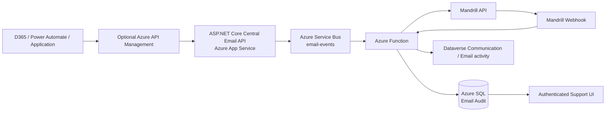

# Central Email Service: Decision Brief

## Recommendation

Choose **Option 2: Central Email Service**. It is the simplest way to centralise Mandrill, logging, retries, security and support visibility for all applications.

The shared library is simpler to start, but every application then owns part of the email platform. That increases duplicated code, duplicated secrets, inconsistent template mappings, inconsistent retries and the blast radius of library changes. A central service is one additional service to operate, but it creates one controlled integration boundary instead of spreading the same responsibility across every application.

The hybrid option is not required as a separate architecture. A typed client library can be added later as a convenience for .NET callers, but it is only a wrapper around the central API, not a third runtime architecture.

## Technology stack

| Need | Technology | Responsibility |
|---|---|---|
| Email API | ASP.NET Core Minimal API | Accepts validated email requests and returns a correlation ID |
| API hosting | Azure App Service | Runs the central API independently of APC applications |
| Gateway | Azure API Management, optional | Stable external URL, authentication policies, throttling, quotas and API documentation |
| Provider | Mandrill API/SDK | Renders and sends the template email; 25,000-email package remains the provider subscription |
| Queue | Azure Service Bus queue `email-events` | Buffers email work and prevents the caller depending on worker availability |
| Worker | Azure Functions, .NET isolated | Sends queued mail, processes provider webhooks and writes audit outcomes |
| Audit store | Separate Azure SQL database | Durable searchable record of requests, sends, provider IDs, status and failures |
| Archive, optional | Azure Blob Storage | Long-term payload/event archive where retention policy requires it |
| Secrets | Azure Key Vault + managed identity | Stores Mandrill and database credentials without putting them in code or flows |
| Monitoring | Application Insights + Azure Monitor | Traces, failures, latency, queue depth and alerts |
| User visibility | Authenticated support UI | Search by recipient, template, source, correlation ID and status |
| CRM visibility | Dataverse Email/Communication activity | Shows a concise communication entry against the relevant Contact or CRM record |

APIM is **not** the API and is not mandatory for the first deployment. App Service hosts the API. APIM sits in front of App Service only when governance, external consumers, quotas or policy enforcement justify its cost.

## Recommended flow



The caller sends one request containing `templateKey`, recipients, canonical data, source system and an optional CRM record reference. The API validates it, assigns a correlation ID and places a message on Service Bus. The Function sends the email and records the result in SQL. Mandrill later sends delivery, reject, bounce or open events to the webhook; the Function correlates those events using the provider message ID or correlation metadata and updates SQL.

For the POC, direct API-to-Mandrill sending can remain enabled to make the demo easy. Production should use the queue as the durable boundary so a temporary Mandrill or worker failure does not lose the request.

## Option comparison

| Option | Technologies | Main advantage | Main concern |
|---|---|---|---|
| Shared library / distributed sending | NuGet library inside each .NET app, each app calls Mandrill | Fast initial start; no central runtime | Duplicated secrets, upgrades, mappings, retries and audit; one library defect affects every consumer after rollout |
| Central email service | ASP.NET Core API on App Service, Service Bus, Function, SQL, Mandrill | One provider boundary, one audit trail, consistent security and operations | One extra service/platform to maintain; requires availability and ownership controls |

## Why the central service is objectively stronger here

At 7,000–8,000 emails per month, the volume does not justify complex distributed infrastructure. It does justify central ownership because multiple systems, D365 and Power Automate need the same provider, templates, logging and support process.

The central service limits change impact. A Mandrill credential rotation, provider API change, retry fix, webhook change or template validation fix is made once. With a shared library, the change must be packaged, tested and deployed across every application, and old versions may continue sending incorrectly.

The “extra service to maintain” concern is valid, but measurable: one App Service, one Function, one queue, one SQL database and one monitoring boundary. The shared-library alternative hides maintenance rather than removing it; it distributes that maintenance and expands the blast radius.

## Independence and failure isolation

The independence argument is legitimate: if every system sends directly through its own library/provider connection, a central outage cannot stop every system. If the Assessment portal fails, D365 and Accreditation can continue. The cost is duplicated provider integration, credentials, template rules, retry logic, monitoring and audit, plus inconsistent behaviour.

A central service has the opposite failure mode: an outage can affect all consumers. Address that explicitly with App Service health checks, rollback, multiple instances, Service Bus durability, retries, dead-letter handling, idempotency, queue-age alerts and an optional break-glass sender for business continuity. Monitor and throttle each source system independently so one bad caller or template does not overwhelm others.

### Are requests lost during an API outage?

There are two different cases:

- **Accepted request:** once the API returns success/accepted, the request is in Service Bus and survives a Function, Mandrill or SQL outage.
- **Rejected/unreachable request:** if the API is down before accepting the request, the central service has not received it. It is not magically recoverable. The caller must retain it and retry; otherwise the caller’s process may lose the email request.

This is a business-continuity requirement, not a reason to pretend the API can never fail. Each caller must use an outbox or durable retry mechanism. For .NET applications, write the email intent to the application database in the same transaction as the business change, then retry delivery until the central API returns an accepted response. Power Automate should use its retry policy and a failure path that stores the payload and alerts support. D365 workflows/plugins should create a durable pending communication record and retry asynchronously rather than depending on a synchronous call.

The API should return clear `5xx`/timeout responses when it cannot accept work; callers must not mark the business operation as successfully emailed until an accepted response is received. Alerting should notify support when the API is unhealthy, when caller outboxes grow, or when the Service Bus queue age exceeds the agreed threshold. A documented break-glass direct-Mandrill process may be used for critical communications, with later reconciliation, but it should not be the normal path.

Therefore, normal business operations continue even when email delivery is temporarily unavailable: the business transaction succeeds, the email intent remains pending, and the email is retried. The design does not guarantee delivery for a caller that discards the request after an API failure.

The central service does not provide application independence in the same way as distributed sending. It provides centralised operational control. For multiple consumers using one provider and one support process, centralisation is the stronger default provided availability and fallback are designed and tested.

## Template mapping without a maintenance trap

Use a small, version-controlled registry in the central service initially:

```text
AssessmentBooked -> assessment-booked
Welcome          -> welcome
```

Use a canonical request contract with predictable variables such as `candidateName`, `assessmentDate`, `practitionerName` and `bookingId`. D365/Power Automate maps Dataverse fields to this contract once for the relevant process. Mandrill templates use the canonical names. The caller must not know Mandrill slugs or provider-specific uppercase names.

Creating a new Mandrill template requires adding its stable key and slug to the central configuration and declaring required variables. Editing the content of an existing template does not require an API deployment. A SQL registry/admin screen is not required initially. Add one only when authorised non-developers need to create mappings, approve versions or manage multiple providers at runtime.

### Why existing and new templates behave differently

An existing template already has a known key-to-slug mapping. A user can change its wording, branding or layout in Mandrill and the running service continues to send the same slug; therefore no application deployment is needed. A brand-new template has no known key or contract in the service. Adding that mapping to version-controlled configuration requires a normal central API release, but it does not require taking the service down. App Service can perform a rolling deployment, and existing templates continue to work. If zero-deployment onboarding is required, store mappings in a database registry or let callers provide the provider slug, accepting weaker governance.

### What “provider adapter” means

The provider adapter is ordinary application code inside the central service, not another Azure service. It converts the central request into Mandrill’s API payload, including the Mandrill slug, merge variables, authentication and response handling. It is an internal class/library such as `MandrillEmailSender`; it can later be replaced by a different provider adapter without changing D365, Power Automate or portal callers.

### Where complex logic belongs

The originating system should own business logic: which records qualify, calculations, permissions, workflow decisions and how its domain data is assembled. It sends the central service an email view model containing the values the template needs. The central service owns delivery concerns: template lookup, provider formatting, generic rendering rules, retries, logging and webhooks. It must not become a second Assessment or Accreditation domain engine.

For a repeating table or collection, the originating system can either send a structured list when the central rendering contract supports it, or render that system-specific section into safe HTML before calling the service. The central service then sends the result without needing to understand the business rules. This addresses the independence concern: domain complexity stays local, while common delivery and audit behaviour remains central. A shared library does not provide a special capability here; it simply causes each application to implement the same provider/delivery concerns locally.

### Template repository versus template mapping

A repository of full template content is different from a mapping registry. Neither architecture inherently requires a Git repository containing every Mandrill HTML template. Both need metadata somewhere: a stable application key, provider slug and expected variables. The central service can keep Mandrill as the content source and store only this small metadata in configuration, a naming convention or a later SQL registry. The shared-library approach usually stores equivalent metadata in each consuming application, which creates multiple sources of truth. Exporting templates to source control is useful for backup, versioning and promotion between environments, but it is an optional governance choice for either architecture, not a special requirement of central email.

## Logging, CRM and unified UI

The API/Function should write an audit record independently of the email content. The minimum record is:

```text
correlationId, sourceSystem, templateKey, recipient, CRM record ID,
providerMessageId, requestedAt, sentAt, currentStatus, error, retry count
```

The initial send result and later webhook result are separate events for the same correlation/provider ID. SQL is the long-lived system of record for technical audit and support searches. Mandrill is the provider system of record for provider-level delivery detail, subject to its retention period.

Non-technical users should not be forced to use a developer-facing support UI. Write a concise Dataverse Communication or Email activity against the Contact/application record containing the template, time, status and correlation ID. This preserves the existing CRM communication-tab experience. The full technical audit remains in the authenticated support UI for support/operations users. Do not duplicate the entire provider payload into Dataverse.

The CRM write-back should be asynchronous and failure-tolerant. A failed Dataverse update must not make the email appear unsent or cause duplicate sends. SQL remains the authoritative technical audit; Dataverse is the business-facing summary.

## Concerns and direct answers

**Is this just an API endpoint?** It exposes endpoints, but is a microservice when independently deployed and responsible for the email capability. The API is its interface; App Service hosts it.

**Is APIM required?** No. Use App Service directly for the first internal deployment. Add APIM for policy, quotas, external consumers or formal API governance.

**Is Service Bus required?** Not for a tiny synchronous proof of concept. It is recommended for production because it separates request acceptance from provider sending, supports retries and provides a dead-letter queue.

**Does the API write both Mandrill and SQL?** The recommended production flow is API -> Service Bus, then Function -> Mandrill and SQL. This avoids a caller waiting for provider work. The POC may send through Mandrill in the API and enqueue the resulting audit event, but that is not the final asynchronous design.

**Can email be sent if SQL is temporarily unavailable?** Yes, if the Function sends first and retries the audit write, or if the audit event is durably queued. The design must prevent duplicate sends with an idempotency key.

**What happens when Mandrill is unavailable?** Service Bus retries with backoff, then moves the message to dead-letter storage. Azure Monitor alerts support staff. No caller-specific Mandrill retry code is required.

**What happens when a template is wrong?** Validate the stable key and required variables before queueing. Reject missing data clearly; do not silently send provider placeholder text.

**Will D365/Power Automate need Mandrill credentials?** No. They authenticate to the central API and send canonical data only.

**Will users see communications in CRM?** Yes, through an asynchronous Dataverse Communication/Email activity summary. Support staff can use the richer audit UI for technical investigation.

**Is the system scalable?** Yes for this volume. The queue and Function can scale independently, while SQL indexes support searches. APIM, Blob archive, multiple workers and additional providers are optional extensions, not day-one requirements.

**Does a shared library make systems independent?** It makes runtime sending independent: each application calls Mandrill directly. It does not make maintenance independent; provider changes, secrets, mappings, retries and audit fixes must be coordinated across every application.

**What if the central service fails?** Accepted requests remain in Service Bus, but callers cannot submit new requests while the API is unavailable. Monitoring, rollback, multiple instances, tested recovery and an optional break-glass fallback reduce this shared blast radius. Distributed sending avoids that single dependency but multiplies maintenance and inconsistency.

**Can new requests be lost?** Not if callers implement a durable outbox/pending-communication record and retry on timeout or non-success. They can be lost if a caller makes a synchronous call and ignores the failure, so retry and alerting are mandatory acceptance criteria for every integration.

## Cost and timeline

The Mandrill 25,000-email package is a fixed provider subscription and should be treated separately from Azure. The exact APC cost cannot be verified from this project because the APC production tenancy was not inspected or accessed. An authorised APC owner should export the current Azure resource list and billing costs before claiming savings or reuse.

For 7,000–8,000 emails/month, Service Bus and Functions consumption are low-volume costs. The significant Azure costs are the App Service plan, SQL tier, monitoring retention and optional APIM. The personal lab currently uses a Basic App Service plan because its F1 quota was exhausted, Basic SQL, Basic Service Bus and a consumption Function. Production pricing must be confirmed in Azure Pricing Calculator using the APC region, retention and existing-resource reuse.

| Phase | Indicative duration | Result |
|---|---:|---|
| Contract, template convention and API | 1–2 weeks | Stable request contract and two pilot templates |
| Service Bus, Function, SQL audit and retries | 1–2 weeks | Durable send and searchable audit |
| D365/Power Automate and CRM write-back | 1–2 weeks | Business process integration |
| Security, monitoring, pilot and rollout | 1–2 weeks | Controlled production onboarding |

## Demo result and lab boundary

The personal lab contains `rg-email-architecture-lab` only: App Service, Function App, Service Bus namespace/queue, Storage, SQL `EmailAudit` and monitoring. It is separate from APC. The local demo runs in simulation mode when `MANDRILL_API_KEY` and `ServiceBusConnection` are absent. Azure mode uses the deployed API, queue and Function settings. The switching instructions are in `docs/BUILD-TUTORIAL.md`.

## Position for the review

“The central service is one additional deployable component, but it centralises a capability we already need in multiple systems. The shared library does not remove operational work; it distributes provider credentials, mappings, retries, upgrades and audit behaviour across every application. At our volume, a small central API with Service Bus, one Function and one audit database is the simpler control point and gives users both CRM visibility and technical support visibility.”
